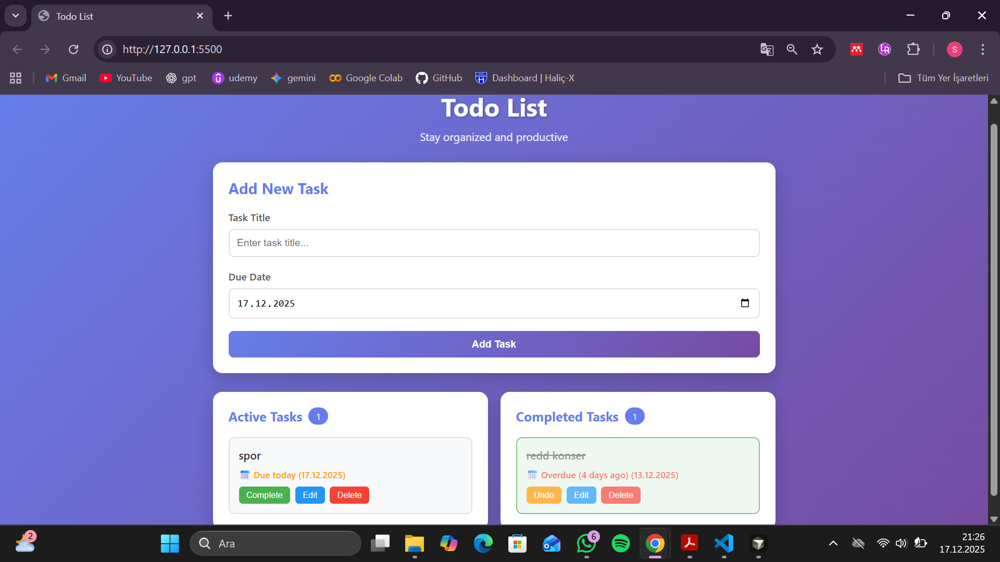

# Todo List App

A modern todo list application built with HTML, CSS, and JavaScript.

## Features

- Add tasks with title and due date
- Edit and delete tasks
- Mark tasks as complete (automatically moves to Completed section)
- LocalStorage persistence (tasks survive page refresh)
- Responsive design

## Screenshot

## Files

- `index.html` - Main HTML file
- `styles.css` - Styling
- `script.js` - Application logic

# Technologies Used

- HTML
- CSS
- JavaScript
- Cursor (AI coding tool)

# How to Run

- Download or clone the repository.
- Open the index.html file in a web browser.
